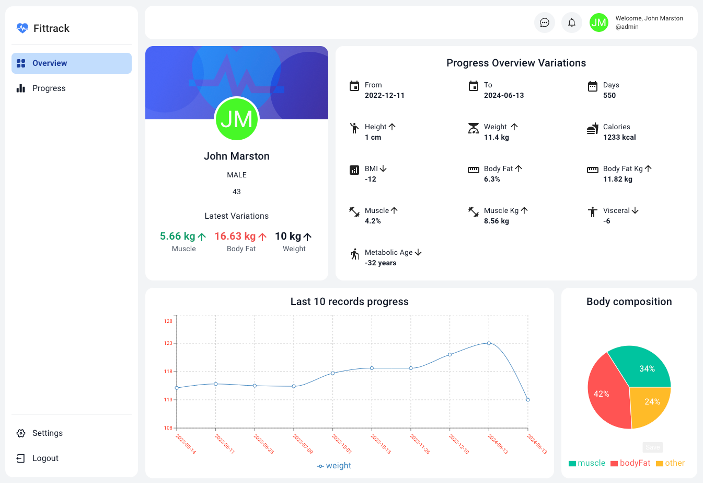

# FitTrack Monorepo

FitTrack is a comprehensive web application leveraging modern web technologies for both the frontend and backend. It uses Typescript and React with Vite for the frontend to ensure a fast and efficient development experience. The backend is powered by Django, providing a robust and scalable server-side framework. The integration of GraphQL via Apollo Client and Graphene ensures efficient data fetching and state management. With a combination of Material-UI, Tailwind CSS, and Emotion, the frontend offers a rich and customizable user interface. The use of Redux Toolkit simplifies state management, and the incorporation of various utility libraries enhances the functionality and efficiency of the application.

## Screenshot



## Description
This monorepo contains the FitTrack frontend and backend applications. The frontend is built with React and Vite, while the backend is built with Django. Both applications are configured to run together using Docker Compose.

## Prerequisites

Before running the project locally, ensure you have the following installed:

- [Docker](https://docs.docker.com/get-docker/)
- [Docker Compose](https://docs.docker.com/compose/install/)
- [Node.js](https://nodejs.org/) (for running npm commands)

## Build and Start the Application
To build and start both the frontend and backend applications, run:
```
npm run dev
```

This command will:

1. Open your browser to http://localhost:5173.
2. Start the Docker Compose services, which will run the frontend on http://localhost:5173 and the backend on http://localhost:8000.

## Development
Both the frontend and backend applications are configured to use hot-reloading. This means any changes you make to the code will be automatically reflected without needing to restart the services.